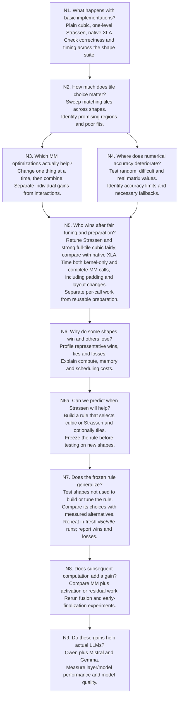

# Proposed experiment flowchart

Status: proposed experiments, not findings. No new experiments have been launched.

The matrix multiplication study is N1–N7, including the new N6a. N8 studies
matrix multiplication with subsequent operations. N9 tests LLM applications.
The original numbers are retained to keep earlier references meaningful.

The shared shape suite includes squares, rectangles with independently varied
M/K/N, actual LLM projection dimensions at varied token counts, and dimensions
requiring partial tiles or padding.

## Timing and prediction details

- N5 retains independent tuning under comparable budgets and fresh confirmation
  measurements. Apply the same requested precision and stated accuracy gates.
- Report kernel latency and the complete device-side MM call separately. Include
  method-specific padding, packing/layout changes and output conversion in the
  complete call wherever required. These are MM timings, not end-to-end inference.
- Report preparation that is needed for each call separately from preparation
  that can be reused with a fixed operand. State the reuse assumptions and show
  amortized costs when claiming a benefit from reuse.
- Reserve the N7 evaluation shapes before constructing the N6a rule. Do not use
  their timings to tune the rule or a predicted tile configuration. After freezing
  its choices, independently benchmark alternatives on those shapes to evaluate
  the selection quality and resulting latency. Predeclare any device-specific
  calibration and distinguish it from transfer without retuning.

## Optional later study

Leave two-level Strassen as a future note, outside the current experiment sequence.
If pursued later, compare zero levels (cubic), one level, and two levels on a small
selection of shapes. This note does not authorize implementing or running that
extension now.
